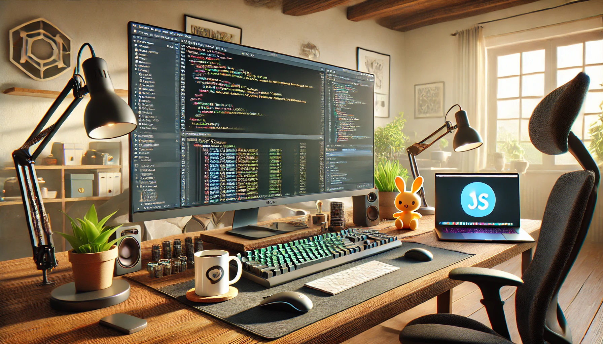

Welcome to my GitHub profile!

I am a highly skilled Web Developer and Software Engineer with expertise in a wide range of technologies and tools used across the globe. Whether it's front-end, back-end, or full-stack development, I have experience with the latest frameworks, libraries, and technologies in the industry.

Skills & Expertise:
- Frontend: HTML5, CSS3, JavaScript, TypeScript, React, Angular, Vue.js, Svelte, and more.
- Backend: Node.js, Express, Django, Flask, Ruby on Rails, Java, C#, Python, Go, PHP.
- Databases: MySQL, PostgreSQL, MongoDB, Firebase, SQLite, Redis, Elasticsearch.
- Cloud & DevOps: AWS, Azure, GCP, Docker, Kubernetes, CI/CD, Terraform, Jenkins, Nginx, Apache.
- Mobile Development: React Native, Flutter, Android (Java/Kotlin), iOS (Swift).
- Version Control: Git, GitHub, GitLab, Bitbucket.
- Other Technologies: GraphQL, WebSockets, REST APIs, Microservices, Serverless, Agile methodologies.

What I Do:
- Develop cutting-edge applications with a focus on scalability, performance, and user experience.
- Collaborate with teams to deliver high-quality software solutions on time.
- Constantly learning new technologies and enhancing my skills.
- Contribute to open-source projects and help others with technical challenges.

Feel free to explore my repositories and check out my latest work. I'm always open to new opportunities, collaborations, and discussions on software development and engineering best practices.
